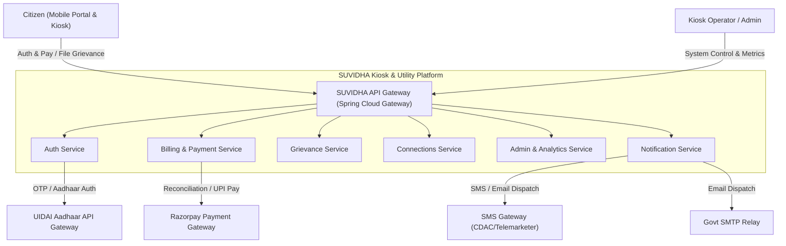
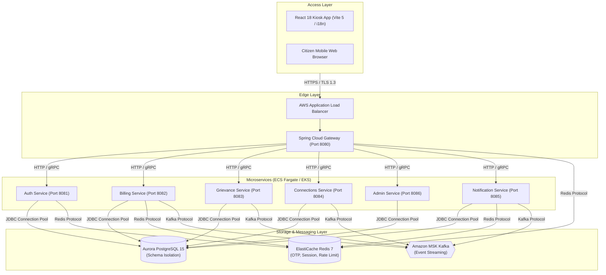
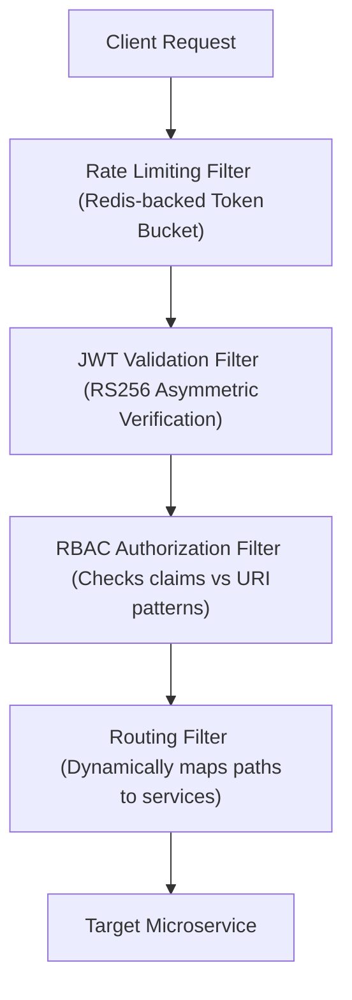
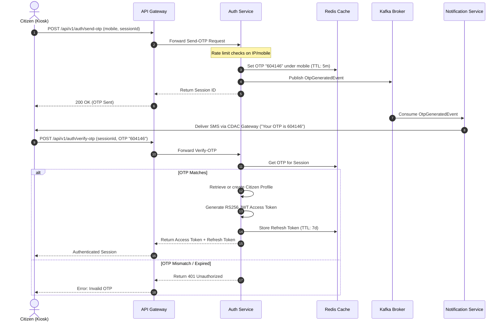
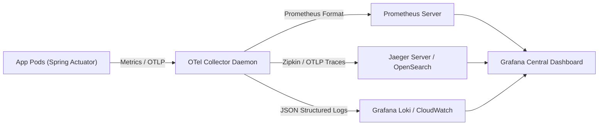
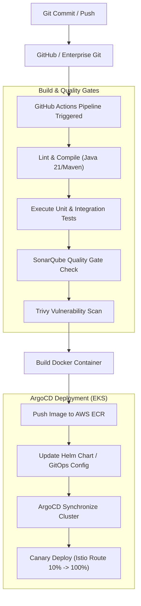
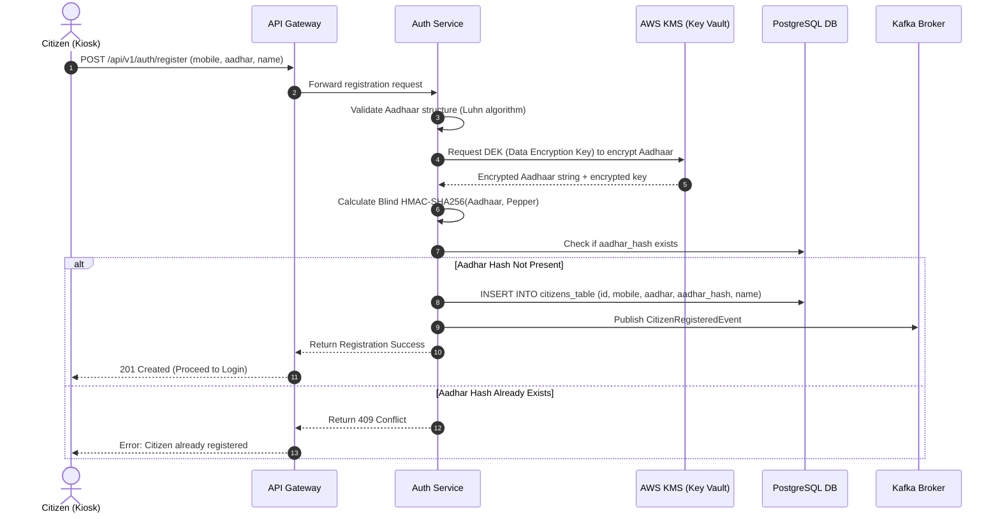
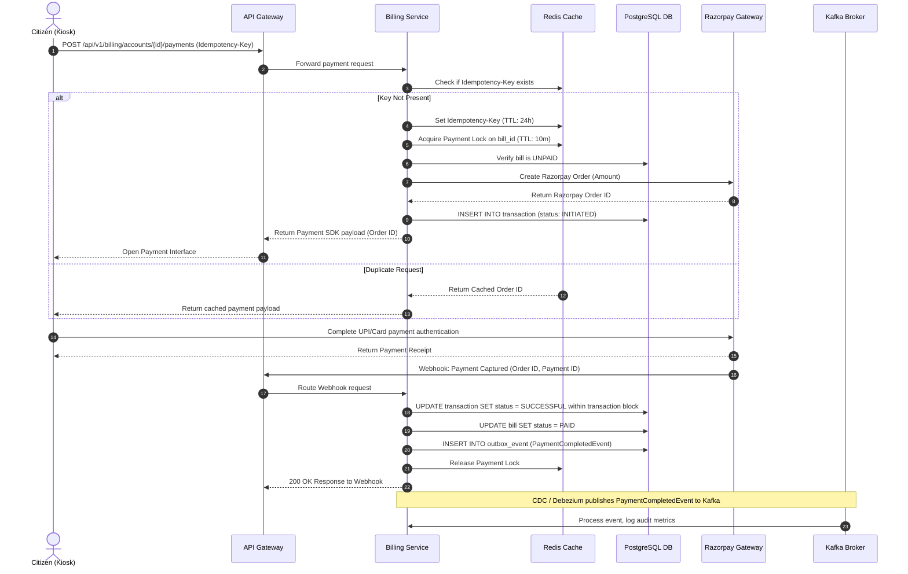
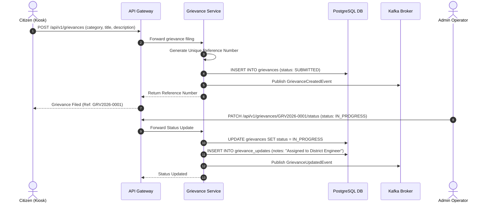
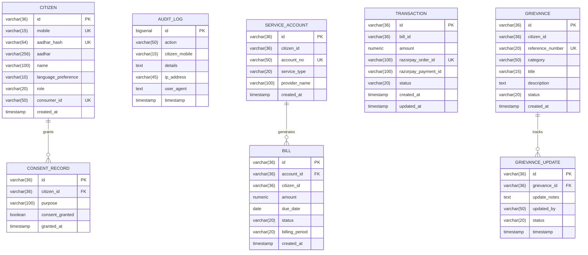

# SUVIDHA 2026: Enterprise Architecture & System Design Document
## Civic Utility Kiosk Platform
**Author:** Principal Software Architect, Cloud & Security Architect
**Status:** Approved for Architecture Review Board (ARB)
**Date:** July 11, 2026

---

## Executive Summary
**SUVIDHA 2026** is a mission-critical Public Utility Services Platform designed to operate as a self-service kiosk system and web portal for millions of citizens across India. The platform facilitates user authentication, billing and payment reconciliation, public grievance filing, utility connection registration, and multichannel notifications. 

The architecture is built on a highly resilient, secure microservices pattern utilizing **Java 21 (virtual threads)**, **Spring Boot 3.2.5**, **Spring Cloud Gateway**, **PostgreSQL 15 (isolated schemas)**, **Redis 7 (caching & sessions)**, and **Apache Kafka** for event-driven coordination. Security controls are strictly aligned with the **Digital Personal Data Protection (DPDP) Act, 2023** and UIDAI specifications for Aadhaar data masking, vaulting, and blind indexing.

---

## 1. High-Level Architecture

The SUVIDHA platform is designed using the C4 Model framework. Below are the context and container level diagrams representing the system architecture.

### 1.1 System Context Diagram
This diagram outlines the boundaries of the SUVIDHA system and its interactions with citizens, operators, and external government/payment integrations.



### 1.2 Container Diagram
This diagram shows the structural containers, including databases, caching instances, and the message broker.



### 1.3 Service Interaction & Request Flow
For synchronous operations (e.g., retrieving active bills or registering an OTP), services communicate via gRPC or REST. For asynchronous orchestration (e.g., dispatching notifications or executing payment lock releases), services utilize Apache Kafka topics.

1. **Client Request**: A kiosk user requests an OTP by entering their mobile number.
2. **Gateway Processing**: The API Gateway validates the request structure, applies rate-limiting rules based on the client IP and mobile number, and routes the request to `suvidha-auth`.
3. **Auth Verification**: `suvidha-auth` generates a secure 6-digit OTP, stores it in Redis with a 5-minute expiration, and publishes an `OtpGeneratedEvent` to Kafka.
4. **Asynchronous Notification**: `suvidha-notification` consumes the `OtpGeneratedEvent` and dispatches an SMS payload to the SMS Gateway API.
5. **Session Verification**: The user enters the OTP at the kiosk, which is validated directly against Redis by `suvidha-auth`. An asymmetric RS256-signed JWT is returned to the client.

---

## 2. Domain Analysis (Domain-Driven Design)

To ensure high cohesion, loose coupling, and clear boundaries, the SUVIDHA system is modeled using Domain-Driven Design (DDD).

```
+---------------------------------------------------------------------------------------------------------+
|                                              SUVIDHA PLATFORM                                           |
+------------------------------------+------------------------------------+-------------------------------+
|      Bounded Context: Auth         |     Bounded Context: Billing       |   Bounded Context: Grievance  |
|  - Citizen Aggregate Root          |  - ServiceAccount Aggregate        |  - Grievance Aggregate Root   |
|  - Aadhaar Valuing Value Object    |  - Bill Aggregate Root             |  - Update Value Object        |
|  - Audit Log Aggregate Root        |  - Transaction Value Object        |                               |
+------------------------------------+------------------------------------+-------------------------------+
|   Bounded Context: Connections     |   Bounded Context: Notification    |    Bounded Context: Admin     |
|  - ConnectionRequest Aggregate Root|  - Notification Aggregate Root     |  - Analytics Aggregate Root   |
|  - Status History Value Object     |  - Template Value Object           |  - Audit Read Model (CQRS)    |
+------------------------------------+------------------------------------+-------------------------------+
```

### 2.1 Bounded Contexts and Microservices Division
1. **Auth & Identity Context (`suvidha-auth`)**: Matches the Citizen identity, Aadhaar data matching, consent verification, and session lifecycle. This is isolated because citizen identity verification requires specialized security policies, encryption controls, and DPDP auditing.
2. **Billing & Payments Context (`suvidha-billing`)**: Manages utility account linkings, utility bills, payment locks, and payment transactions. This context is separated due to its high transaction write load, strict ACID compliance requirements, and integration with third-party payment gateways.
3. **Grievance Redressal Context (`suvidha-grievance`)**: Handles citizen complaints, administrative category trees, status changes, and escalation trails. Isolated because of its distinct workflow-driven lifecycle and lower scaling demands compared to billing.
4. **Utility Connections Context (`suvidha-connections`)**: Manages requests for new electricity, water, or gas connections. Requires document processing integrations, feasibility verification, and physical inspection workflows.
5. **Notification Context (`suvidha-notification`)**: Handles templating and dispatch of SMS, Email, and Push Notifications. Isolated to prevent external network delays (SMS gateway APIs) from impacting core transaction threads.
6. **Admin & Analytics Context (`suvidha-admin`)**: Consolidates business activity reports, metrics dashboards, and operator audit trails. Uses read replicas to run reporting queries without impacting transaction latency.

---

## 3. Service Design

Each microservice is designed as an independent unit of deployment with dedicated resources.

| Microservice | Purpose | Database Schema | Scaling Strategy | Tech Stack |
|---|---|---|---|---|
| **suvidha-gateway** | Perimeter security, routing, rate limiting | None (uses Redis 7 for rate-limiting bucket) | Horizontal scaling via HPA (CPU > 75%) | Java 21, Spring Cloud Gateway Reactive |
| **suvidha-auth** | User registration, Aadhaar Vaulting, OTP control, RS256 token issuance | `auth` & `public` schemas | Horizontal scaling (CPU > 70%), optimized for high read/write to Redis | Java 21, Spring Boot, Spring Security, Hibernate |
| **suvidha-billing** | Account linkings, bills, payments, Outbox event generation | `billing` schema | Horizontal scaling, DB connection pool optimization (HikariCP) | Java 21, Spring Boot, Spring Data JPA, HikariCP |
| **suvidha-grievance** | Grievance registration, updates, escalations | `grievance` schema | Small deployment footprint, scaling based on CPU | Java 21, Spring Boot, Spring Data JPA |
| **suvidha-connections**| Utility connection request life cycle | `connections` schema | Medium footprint, auto-scales on memory consumption | Java 21, Spring Boot, Spring Data JPA |
| **suvidha-notification**| Sending emails, OTP SMS, transaction notifications | `notification` schema | Scaled horizontally using consumer group lag thresholds | Java 21, Spring Boot, Spring Kafka, Redis |
| **suvidha-admin** | Global statistics dashboard, audit views | `admin` schema | Read-replica heavy query patterns, scales on HTTP requests | Java 21, Spring Boot, WebMvc, Actuator |

---

### Detailed Service Specifications

#### 3.1 Auth Service (`suvidha-auth`)
* **Purpose**: Manages Citizen profiles, issues asymmetric JWT tokens, and handles secure Aadhaar checks.
* **Responsibilities**:
  * Generate and verify OTP sessions (Redis backed).
  * Encrypt, hash, and query Aadhaar numbers securely (DPDP compliance).
  * Schedule, sign, and distribute asymmetric RS256 keys.
  * Audit all identity modifications and consent registers.
* **Database**: PostgreSQL (shared cluster, dedicated schemas: `public` and `auth`).
* **Public APIs**:
  * `POST /api/v1/auth/register` (Registers citizen with mobile and Aadhaar).
  * `POST /api/v1/auth/send-otp` (Generates OTP, returns session ID).
  * `POST /api/v1/auth/verify-otp` (Validates OTP, returns RS256 Access Token & Refresh Token).
  * `POST /api/v1/auth/refresh` (Rotates Access Token via Refresh Token verification).
  * `POST /api/v1/auth/logout` (Revokes refresh token in Redis).
  * `GET /api/v1/auth/profile` (Returns current citizen profile).
* **Internal APIs**:
  * `GET /api/v1/auth/public-key` (Used by API Gateway to fetch active signing keys).
  * `POST /api/v1/auth/consent/log` (Logs a citizen DPDP consent record).
* **Events Published**:
  * `OtpGeneratedEvent` (To `suvidha.notification.otp` topic).
  * `CitizenRegisteredEvent` (To `suvidha.auth.citizen-registered` topic).
  * `DataBreachDeclaredEvent` (To `suvidha.security.alerts` topic).
* **Events Consumed**: None.
* **Dependencies**: Redis, PostgreSQL, External SMS Gateway API (notified asynchronously).
* **Scaling Strategy**: Scaled horizontally on EKS using HPA based on average CPU utilization target (70%). Pre-warmed replicas configured during high-traffic times.
* **Failure Scenarios**:
  * *Redis failure*: OTP verification falls back to a temporary restricted state or rejects requests. Mitigation: Redis Sentinel clustered deployment.
  * *Database failure*: Read-only mode activated; JWT generation still works if user is already authenticated and session is cached.
* **Technology Stack**: Java 21 (Virtual Threads), Spring Boot 3.2.5, Spring Security, Hibernate, JJWT, Flyway.
* **Deployment Strategy**: Kubernetes Rolling Update (`maxSurge: 50%`, `maxUnavailable: 0%`).
* **Security Requirements**:
  * AES-256-GCM encryption of Aadhaar numbers using keys managed in AWS KMS.
  * SHA-256 HMAC Blind indexing of Aadhaar to prevent table scans during lookup.
  * Asymmetric RS256 token signing with weekly auto-rotation.

#### 3.2 Billing Service (`suvidha-billing`)
* **Purpose**: Tracks utility accounts, compiles bills, and coordinates transactional payments.
* **Responsibilities**:
  * Fetch bills across linked accounts (Electricity, Water, Gas).
  * Process payments using double-write protection (Transactional Outbox).
  * Issue payment locks to prevent double-payment.
  * Track and record meter readings.
* **Database**: PostgreSQL (schema: `billing`).
* **Public APIs**:
  * `GET /api/v1/billing/accounts` (Retrieves user's linked utility accounts).
  * `POST /api/v1/billing/accounts` (Links a new utility account).
  * `GET /api/v1/billing/accounts/{id}/bills` (Lists bills for an account).
  * `POST /api/v1/billing/accounts/{id}/payments` (Initializes payment flow, returns payment locking key).
  * `GET /api/v1/billing/accounts/{id}/payments/{txn}/receipt` (Generates PDF receipt for payment transaction).
* **Internal APIs**:
  * `POST /internal/v1/billing/reconcile` (Called by webhook on payment gateway response).
* **Events Published**:
  * `PaymentInitiatedEvent` (Topic: `suvidha.billing.payment-initiated`).
  * `PaymentCompletedEvent` (Topic: `suvidha.billing.payment-completed`).
  * `OutboxEvent` (Published to Kafka by Debezium/Polling pipeline).
* **Events Consumed**:
  * `ConnectionApprovedEvent` (From `suvidha.connections.events`).
* **Dependencies**: PostgreSQL, Redis (for locking), Razorpay SDK/APIs, Kafka.
* **Scaling Strategy**: Scales based on CPU utilization and DB connection pool depletion metrics.
* **Failure Scenarios**:
  * *Payment Gateway down*: Payment flows transition to "PENDING_RECONCILIATION" and auto-resolve via webhook/cron retry.
  * *Database lock contention*: Handled by Optimistic Locking on Bill entities and distributed Redis-based lock acquisition.
* **Technology Stack**: Java 21, Spring Boot, Spring Data JPA, HikariCP, Redis, PostgreSQL.
* **Deployment Strategy**: Canary deployments with Istio.

---

## 4. API Gateway

The API Gateway is the central entry point for all kiosk and mobile client requests. It runs **Spring Cloud Gateway Reactive** on Java 21.



### 4.1 Routing & Architecture
* **Path-Based Routing**: Maps incoming paths to downstream microservices using dynamic patterns:
  * `/api/v1/auth/**` -> `http://suvidha-auth:8081`
  * `/api/v1/billing/**` -> `http://suvidha-billing:8082`
  * `/api/v1/grievances/**` -> `http://suvidha-grievance:8083`
  * `/api/v1/connections/**` -> `http://suvidha-connections:8084`
  * `/api/v1/notifications/**` -> `http://suvidha-notification:8085`
  * `/api/v1/admin/**` -> `http://suvidha-admin:8086`

### 4.2 Security Operations at the Edge
* **Token Verification**: 
  The Gateway intercepts all requests (except `/api/v1/auth/send-otp`, `/api/v1/auth/verify-otp`, and `/health`). It verifies the JWT signature using the public keys obtained from `suvidha-auth`'s `/public-key` endpoint, which are cached in memory with a short TTL (10 minutes) to support key rotation.
* **Rate Limiting**:
  Implemented using a Redis-backed **Token Bucket algorithm**. 
  * Rate limits are configured at different levels:
    * `/api/v1/auth/send-otp`: 3 requests per 10 minutes per IP/mobile number to prevent OTP flooding.
    * `/api/v1/billing/**`: 60 requests per minute per authenticated user.
    * Standard GET requests: 120 requests per minute per IP.
* **CORS and Security Headers**:
  The Gateway injects standard headers (`X-Content-Type-Options: nosniff`, `X-Frame-Options: DENY`, `Content-Security-Policy: default-src 'self'`). It limits access origins via strict CORS policies to protect kiosk applications from external site attacks.

---

## 5. Authentication & Authorization

### 5.1 OTP-Based Authentication Flow
SUVIDHA uses passwordless registration/login based on verified mobile numbers linked to Aadhaar details.



### 5.2 JWT Configuration
* **Algorithm**: RS256 (Asymmetric RSA Key pairs, 2048-bit length).
* **Token Life**: Access Tokens are short-lived (15 minutes). Refresh tokens are long-lived (7 days).
* **Refresh Token Rotation (RTR)**:
  Every time a refresh token is used to issue a new access token, the current refresh token is invalidated, and a new refresh token is returned to the client. This prevents replay attacks if a refresh token is intercepted.

### 5.3 RBAC & ABAC Policies
Access is governed by Role-Based Access Control (RBAC) and Attribute-Based Access Control (ABAC):
* **CITIZEN**: Can view their own profile, register utility accounts, pay bills, and file grievances.
* **OPERATOR**: Authorized to interact with kiosk settings, view status diagnostics, and assist users under logged audit conditions.
* **ADMIN**: Can modify configuration, view global payment dashboards, and audit data access logs.
* **ABAC Policy Example**: A user can access and update a grievance *only if* the `citizen_id` matches their verified user ID in the JWT payload, or if the operator possesses the specific tenant context matching the kiosk's district.

---

## 6. Database Architecture

SUVIDHA uses a shared PostgreSQL 15 database instance with strict **schema isolation** to prevent unauthorized cross-boundary data access.

```
+-------------------------------------------------------------------------------+
|                       PostgreSQL 15 Database (suvidha_auth_db)                 |
|                                                                               |
|  +--------------------+  +--------------------+  +-------------------------+  |
|  |   Schema: public   |  |    Schema: auth    |  |     Schema: billing     |  |
|  | - citizens_table   |  | - audit_logs       |  | - service_account       |  |
|  | - jwt_key_versions |  | - consent_records  |  | - bill                  |  |
|  | - refresh_tokens   |  | - data_breaches    |  | - transaction           |  |
|  +--------------------+  +--------------------+  +-------------------------+  |
|  +--------------------+  +--------------------+  +-------------------------+  |
|  | Schema: grievance  |  | Schema: connections|  |  Schema: notification   |  |
|  | - grievances       |  | - connection_reqs  |  | - notifications         |  |
|  | - grievance_updates|  |                    |  |                         |  |
|  +--------------------+  +--------------------+  +-------------------------+  |
+-------------------------------------------------------------------------------+
```

### 6.1 Database Schema Definition & Mappings

#### 6.1.1 `public` & `auth` Schema (Auth Service)
```sql
CREATE TABLE public.citizens_table (
    id VARCHAR(36) PRIMARY KEY,
    mobile VARCHAR(15) UNIQUE NOT NULL,
    aadhar_hash VARCHAR(64) UNIQUE NOT NULL,
    aadhar VARCHAR(256) NOT NULL, -- Encrypted AES-256 format
    name VARCHAR(100) NOT NULL,
    language_preference VARCHAR(10) DEFAULT 'en',
    role VARCHAR(20) NOT NULL,
    consumer_id VARCHAR(50) UNIQUE NOT NULL,
    created_at TIMESTAMP WITH TIME ZONE DEFAULT CURRENT_TIMESTAMP
);

CREATE TABLE auth.audit_logs (
    id BIGSERIAL PRIMARY KEY,
    action VARCHAR(50) NOT NULL,
    citizen_mobile VARCHAR(15),
    details TEXT,
    ip_address VARCHAR(45),
    user_agent TEXT,
    timestamp TIMESTAMP WITH TIME ZONE DEFAULT CURRENT_TIMESTAMP
);

CREATE TABLE auth.consent_records (
    id VARCHAR(36) PRIMARY KEY,
    citizen_id VARCHAR(36) REFERENCES public.citizens_table(id),
    purpose VARCHAR(100) NOT NULL,
    consent_granted BOOLEAN DEFAULT TRUE,
    granted_at TIMESTAMP WITH TIME ZONE DEFAULT CURRENT_TIMESTAMP
);

CREATE INDEX idx_citizen_mobile ON public.citizens_table(mobile);
CREATE INDEX idx_citizen_aadhar_hash ON public.citizens_table(aadhar_hash);
CREATE INDEX idx_audit_timestamp ON auth.audit_logs(timestamp);
```

#### 6.1.2 `billing` Schema (Billing Service)
```sql
CREATE TABLE billing.service_account (
    id VARCHAR(36) PRIMARY KEY,
    citizen_id VARCHAR(36) NOT NULL, -- Logical reference (no FK constraint across schemas)
    account_no VARCHAR(50) UNIQUE NOT NULL,
    service_type VARCHAR(20) NOT NULL, -- ELECTRICITY, WATER, GAS
    provider_name VARCHAR(100) NOT NULL,
    created_at TIMESTAMP WITH TIME ZONE DEFAULT CURRENT_TIMESTAMP
);

CREATE TABLE billing.bill (
    id VARCHAR(36) PRIMARY KEY,
    account_id VARCHAR(36) REFERENCES billing.service_account(id),
    citizen_id VARCHAR(36) NOT NULL,
    amount NUMERIC(12,2) NOT NULL,
    due_date DATE NOT NULL,
    status VARCHAR(20) NOT NULL, -- UNPAID, PAID, OVERDUE, LOCK
    billing_period VARCHAR(20) NOT NULL,
    created_at TIMESTAMP WITH TIME ZONE DEFAULT CURRENT_TIMESTAMP
);

CREATE TABLE billing.transaction (
    id VARCHAR(36) PRIMARY KEY,
    bill_id VARCHAR(36) NOT NULL, -- Logical reference
    amount NUMERIC(12,2) NOT NULL,
    razorpay_order_id VARCHAR(100) UNIQUE NOT NULL,
    razorpay_payment_id VARCHAR(100),
    status VARCHAR(20) NOT NULL, -- INITIATED, SUCCESSFUL, FAILED, TIMED_OUT
    created_at TIMESTAMP WITH TIME ZONE DEFAULT CURRENT_TIMESTAMP,
    updated_at TIMESTAMP WITH TIME ZONE
);

CREATE TABLE billing.outbox_event (
    id VARCHAR(36) PRIMARY KEY,
    aggregate_type VARCHAR(50) NOT NULL,
    aggregate_id VARCHAR(36) NOT NULL,
    event_type VARCHAR(50) NOT NULL,
    payload TEXT NOT NULL, -- JSON formatted data
    created_at TIMESTAMP WITH TIME ZONE DEFAULT CURRENT_TIMESTAMP,
    processed BOOLEAN DEFAULT FALSE
);

CREATE INDEX idx_bill_account_id ON billing.bill(account_id);
CREATE INDEX idx_bill_citizen_id ON billing.bill(citizen_id);
CREATE INDEX idx_txn_order_id ON billing.transaction(razorpay_order_id);
CREATE INDEX idx_outbox_unprocessed ON billing.outbox_event(created_at) WHERE processed = FALSE;
```

#### 6.1.3 `grievance` Schema (Grievance Service)
```sql
CREATE TABLE grievance.grievances (
    id VARCHAR(36) PRIMARY KEY,
    citizen_id VARCHAR(36) NOT NULL, -- Logical reference
    reference_number VARCHAR(20) UNIQUE NOT NULL,
    category VARCHAR(50) NOT NULL,
    title VARCHAR(150) NOT NULL,
    description TEXT NOT NULL,
    status VARCHAR(20) NOT NULL, -- SUBMITTED, IN_PROGRESS, RESOLVED, CLOSED
    created_at TIMESTAMP WITH TIME ZONE DEFAULT CURRENT_TIMESTAMP
);

CREATE TABLE grievance.grievance_updates (
    id VARCHAR(36) PRIMARY KEY,
    grievance_id VARCHAR(36) REFERENCES grievance.grievances(id) ON DELETE CASCADE,
    update_notes TEXT NOT NULL,
    updated_by VARCHAR(50) NOT NULL, -- User/Operator identity
    status VARCHAR(20) NOT NULL,
    timestamp TIMESTAMP WITH TIME ZONE DEFAULT CURRENT_TIMESTAMP
);

CREATE INDEX idx_grievance_ref ON grievance.grievances(reference_number);
CREATE INDEX idx_grievance_citizen ON grievance.grievances(citizen_id);
```

### 6.2 Sharding, Partitioning, and Backup Strategy
* **Partitioning**: 
  The `auth.audit_logs` and `billing.transaction` tables are partitioned by **Range** based on `created_at` fields. A new partition is dynamically provisioned every quarter. Older partitions are converted to read-only tables and offloaded to cold storage to keep transaction indices compact.
* **Replication**:
  Aurora PostgreSQL is deployed in a Multi-AZ cluster. A writer instance handles write operations in Availability Zone `ap-south-1a`, while two auto-scaling read replicas are maintained in `ap-south-1b` and `ap-south-1c`. Real-time database reading requests (such as analytics generation in `suvidha-admin`) bypass the writer instance to target replicas directly.
* **Backup & Recovery**:
  * Continuous automated backups with a **7-day Point-In-Time Recovery (PITR)** window.
  * Daily EBS snapshots retained for 35 days, copied to a separate AWS region (`ap-east-1`) to enable disaster recovery.
  * Monthly logical export backups stored in S3 Glacier with a 7-year retention policy for regulatory compliance.

---

## 7. Communication & Event-Driven Architecture

SUVIDHA utilizes a hybrid communication architecture to balance low latency for synchronous tasks with eventual consistency for asynchronous processing.

### 7.1 Synchronous Communication (gRPC & REST)
* **REST APIs**: Used for external client-to-gateway interactions, providing standard HTTP endpoints for the kiosk React application.
* **gRPC**: Configured for internal service-to-service communication. For example, when `suvidha-billing` needs to verify citizen ownership, it queries `suvidha-auth` via a gRPC stub rather than REST, leveraging HTTP/2 multiplexing and Protocol Buffer binary serialization to achieve sub-millisecond latencies.

### 7.2 Asynchronous Event-Driven Architecture (Kafka)
Event-driven design ensures services remain decoupled. Apache Kafka acts as the message broker.

```
                  +-----------------------------------+
                  |           Billing Service         |
                  +-----------------+-----------------+
                                    |
                    Write Transaction | (Atomic Local DB Write)
                                    v
                  +-----------------+-----------------+
                  |      Outbox Table Transaction     |
                  +-----------------+-----------------+
                                    |
                    Debezium / CDC  | (Transactional log reader)
                                    v
                  +-----------------+-----------------+
                  |            Kafka Broker           |
                  |     (Topic: suvidha.payments)     |
                  +-----------------+-----------------+
                                    |
                    Kafka Consumer  | (Eventual consistency)
                                    v
                  +-----------------+-----------------+
                  |        Notification Service       |
                  +-----------------------------------+
```

#### 7.2.1 Transactional Outbox Pattern
To prevent dual-write inconsistencies (e.g., updating database records but failing to publish events due to a broker outage), SUVIDHA implements the **Transactional Outbox Pattern**:
1. Within a single `@Transactional` boundary, the business update is executed in the table, and an event is inserted into the `billing.outbox_event` table.
2. A lightweight outbox polling scheduler (or Debezium Connector using PostgreSQL CDC) scans the outbox table for unprocessed items.
3. The event is written to Kafka. Once the broker returns an acknowledgment, the outbox record is marked as `processed = true` (or deleted).
4. This ensures **at-least-once delivery** of critical business events.

#### 7.2.2 Idempotency and Deduplication
* **Idempotency Keys**:
  All billing payments require a unique `Idempotency-Key` header generated by the client. The payment processing service saves this key in Redis for 24 hours. If a duplicate request with the same key is received, the service returns the cached transaction status immediately rather than submitting another request to the payment gateway.
* **Consumer Deduplication**:
  Kafka consumers maintain a processing log of consumed message IDs in PostgreSQL (`processed_events`). Before handling a message, the consumer performs a duplicate check. If the event ID exists in the database, the message is skipped.

#### 7.2.3 Retries and Dead Letter Queue (DLQ)
* **Non-blocking Retries**:
  If a consumer fails to process a message due to a transient error (e.g., connection timeouts), the event is forwarded to a retry topic (`suvidha.payments-retry-5s`) with a backoff duration.
* **Dead Letter Topic**:
  After 3 unsuccessful retry attempts, the message is routed to a Dead Letter Queue topic (`suvidha.payments-dlq`) for manual inspection and alerting.

---

## 8. Infrastructure

SUVIDHA is built to run natively on container orchestration platforms.

```
+--------------------------------------------------------------------------------------+
|                                 Kubernetes Cluster                                   |
|                                                                                      |
|   +------------------------------------------------------------------------------+   |
|   |                       Namespace: suvidha-production                          |   |
|   |                                                                              |   |
|   |   +-----------------------+  +-------------------+  +---------------------+  |   |
|   |   |  Ingress (Nginx/ALB)  |  |  Service Mesh     |  | Pod Autoscalers     |  |   |
|   |   |  - Path routing rules |  |  - Mutual TLS     |  |  - HPA on memory/CPU|  |   |
|   |   |  - TLS termination    |  |  - Traffic split  |  |  - Custom metrics   |  |   |
|   |   +-----------+-----------+  +---------+---------+  +----------+----------+  |   |
|   |               |                        |                       |             |   |
|   |               v                        v                       v             |   |
|   |   +-----------------------------------------------------------------------+  |   |
|   |   |                    Microservice Pod Deployments                       |  |   |
|   |   |  [gateway]       [auth-service]     [billing-service]     [grievance] |  |   |
|   |   +-----------------------------------------------------------------------+  |   |
|   +------------------------------------------------------------------------------+   |
+--------------------------------------------------------------------------------------+
```

### 8.1 Kubernetes Deployment Configurations
* **Kubernetes Namespaces**:
  * `suvidha-infra`: Contains base operational components (Kafka Strimzi operators, Redis clusters, monitoring logging stacks).
  * `suvidha-staging`: Pre-production verification sandbox.
  * `suvidha-production`: The live production cluster workspace.
* **Service Mesh (Istio)**:
  * Manages zero-trust service communication by enforcing mutual TLS (mTLS) between all microservices.
  * Dynamically controls Canary deployments using virtual services and traffic-splitting parameters.
* **Horizontal Pod Autoscaling (HPA)**:
  Auto-scales microservice deployments based on mixed targets:
  * Core services: CPU target > 75%, Memory usage > 80%.
  * Notification service: Scaled via Prometheus custom metrics indicating Kafka Consumer Lag (scales up if lag > 1,000 messages).

---

## 9. Cloud Architecture (AWS Deployment)

The deployment architecture utilizes AWS services across multiple Availability Zones to ensure high availability and disaster recovery compliance.

```
+-------------------------------------------------------------------------------------------+
|                                    AWS Region: ap-south-1                                 |
|                                                                                           |
|    +--------------------------+  +--------------------------+  +---------------------+    |
|    |      Route 53 DNS        |  |      CloudFront CDN      |  |  AWS Shield (DDoS)  |    |
|    +------------+-------------+  +------------+-------------+  +----------+----------+    |
|                 |                             |                           |               |
|                 +-----------------------------+---------------------------+               |
|                                               |                                           |
|                                               v                                           |
|                                  AWS Application Load Balancer                            |
|                                               |                                           |
|         +-------------------------------------+-----------------------------------+       |
|         | Public Subnets (NAT Gateway)                                            |       |
|         +-------------------------------------+-----------------------------------+       |
|                                               |                                           |
|         +-------------------------------------+-----------------------------------+       |
|         | Private App Subnets (EKS Worker Nodes / ECS Fargate)                    |       |
|         | [AZ-A] Worker Node 1        [AZ-B] Worker Node 2        [AZ-C] Worker 3 |       |
|         +-------------------------------------+-----------------------------------+       |
|                                               |                                           |
|         +-------------------------------------+-----------------------------------+       |
|         | Private Data Subnets (Isolated Data Store Layers)                       |       |
|         | [AZ-A] Aurora DB Writer     [AZ-B] Read Replica 1       [AZ-C] Replica  |       |
|         | [AZ-A] ElastiCache Redis    [AZ-B] Redis Replica        [AZ-C] MSK Kafka|       |
|         +-------------------------------------------------------------------------+       |
+-------------------------------------------------------------------------------------------+
```

### 9.1 Base Components Design
* **Global Edge Protection**:
  All incoming kiosk request traffic hits AWS Route 53, which routes traffic to CloudFront (CDN caching static assets of UI). AWS WAF and AWS Shield are attached to CloudFront to mitigate Layer 7 vulnerability attacks and volumetric DDoS attempts.
* **Network Isolation**:
  * **Public Subnets**: Host only the Application Load Balancer (ALB) and NAT Gateways.
  * **Private App Subnets**: Host the EKS/ECS Fargate worker nodes. These nodes have no public IP addresses.
  * **Private Data Subnets**: Encompass database layers, Redis instances, and MSK brokers, isolated with strict Security Group parameters limiting access only to corresponding private application nodes.
* **Secrets Management**:
  API keys, database passwords, and cryptographic keys are loaded at runtime into application containers from AWS Secrets Manager using IAM Roles for Service Accounts (IRSA) to avoid hardcoding credentials in environmental parameters.

---

## 10. Security Hardening

Security design is central to the architecture, particularly to comply with national digital storage policies.

```
+-----------------------------------------------------------------------------+
|                             Aadhaar Data Vault                              |
|                                                                             |
|  [Raw Aadhaar Number]                                                       |
|          |                                                                  |
|          |---> AES-256-GCM (AWS KMS Key Envelope) ---> [Encrypted Aadhaar]   |
|          |                                                                  |
|          +---> SHA-256 + Pepper (Blind Index) ------> [Aadhaar Hash Field]  |
|                                                                             |
|  * Search Queries use [Aadhaar Hash Field] (Lookup index without decryption) |
+-----------------------------------------------------------------------------+
```

### 10.1 Aadhaar Vaulting and DPDP Act Compliance
1. **Aadhaar Data Encryption**:
   Aadhaar card numbers must not be stored in plaintext. They are encrypted using **AES-256-GCM** authenticated envelope encryption. The data encryption key (DEK) is generated per-record and encrypted using a Master Key stored in AWS KMS.
2. **Blind Indexing**:
   To find an Aadhaar record without decrypting every row in the database (which creates a massive CPU bottleneck and security risk), a **Blind Index** is used:
   $$\text{Aadhaar Hash} = \text{HMAC-SHA256}(\text{Aadhaar Number}, \text{Secret Pepper Key})$$
   The `aadhar_hash` is indexed with a unique constraint. Queries lookup using the blind hash, keeping the actual Aadhaar number securely encrypted at rest.
3. **Data Erasure & Consent Tracking**:
   The `auth.consent_records` table tracks citizen consent for data collection. If a citizen revokes consent, an automated workflow executes data redaction scripts, adhering to the "Right to Erasure" under the DPDP Act.

### 10.2 Security Controls Matrix
* **OWASP Top 10 Protections**:
  * *SQL Injection*: Prevented by compile-time query verification using Spring Data JPA Repositories and Named Parameter Binding.
  * *Broken Object Level Authorization (BOLA)*: Handled by custom interceptors that verify if the resource's owner ID matches the JWT subject ID before completing the request.
  * *SSRF Prevention*: Downstream proxy clients enforce URL whitelisting, preventing requests to metadata IP addresses (`169.254.169.254`).
* **Transport Encryption**:
  TLS 1.3 is enforced at the API Gateway level. Service mesh configurations mandate mTLS using SPIFFE/SPIRE certificates within the EKS cluster.
* **Audit Logging**:
  Every attempt to view or query citizen data is logged to an immutable audit file system, shipped directly to CloudWatch logs with read-only permissions to prevent audit tampering.

---

## 11. Observability

Observability is implemented using standard **OpenTelemetry** specifications to aggregate metrics, logs, and distributed traces.



### 11.1 Metrics and Alerts Design
* **OpenTelemetry Integration**:
  Microservice runtimes include the OTel agent jar to gather instrumentation details automatically.
* **Metrics Pipeline**:
  Prometheus scrapes Micrometer metrics exposed via `/actuator/prometheus` endpoints. Metrics are visualized on Grafana.
* **Tracing**:
  Distributed trace context headers (`traceparent`) are propagated through the API Gateway across downstream services via gRPC metadata or HTTP headers, enabling end-to-end request tracing on Jaeger.
* **SLO and Alerting Thresholds**:
  * **System SLO**: 99.99% successful payments over a rolling 30-day window.
  * **Service Latency SLI**: API Gateway response duration under 100ms for p95 requests.
  * **Alerting**: PagerDuty notifications trigger if the 5xx HTTP response rate exceeds 1% of total requests over a 2-minute period.

---

## 12. CI/CD Architecture

The deployment pipeline is built to enforce security audits and compile builds automatically.



### 12.1 Git branching and Release Pipeline
* **Branching Strategy**:
  Trunk-based development with short-lived feature branches. Merges to `main` require linear history, passing builds, and approvals from at least two senior code reviewers.
* **Deployment Execution**:
  * **Canary Split**: Helm charts define deployments configured under Istio Virtual Services.
  * When a new version is pushed, ArgoCD deploys a Canary version. Istio routes 10% of production traffic to the new version.
  * Grafana monitors performance metrics (error rate, latency) for 15 minutes. If metrics remain healthy, traffic scales incrementally to 100%. If an anomaly is detected, traffic reverts to the stable version automatically.

---

## 13. Performance Optimizations

To handle high concurrent traffic from kiosk clients, several optimization strategies are implemented:

* **Two-Level Caching**:
  * **Level 1 (In-Memory)**: Caffeine cache stored locally inside microservice runtimes for static data (like configurations, utility provider details).
  * **Level 2 (Distributed)**: Redis 7 cluster for transient operational data (active bills, valid JWT key structures, rate-limiting tokens).
* **Connection Pooling**:
  HikariCP is configured with specific parameters optimized for PostgreSQL connection reuse:
  ```properties
  spring.datasource.hikari.minimum-idle=10
  spring.datasource.hikari.maximum-pool-size=50
  spring.datasource.hikari.idle-timeout=30000
  spring.datasource.hikari.max-lifetime=1800000
  spring.datasource.hikari.connection-timeout=15000
  ```
* **Database Query Performance**:
  Index designs are continually verified. Large queries from kiosk endpoints utilize cursor-based pagination rather than offset pagination to avoid full table scans.

---

## 14. Reliability & Fault Tolerance

```
+-----------------------------------------------------------------------------+
|                            Resilience Patterns                              |
|                                                                             |
|  [Gateway Request]                                                          |
|         |                                                                   |
|         v                                                                   |
|  [Circuit Breaker (Resilience4j)]                                           |
|         |                                                                   |
|         +---> [Call Success] ---> Return Response                           |
|         |                                                                   |
|         +---> [Failures > 50%] -> Open State (Return Fallback from Cache)   |
|                                                                             |
|  * Bulkhead limits concurrent calls. Timeout halts long-running blocks.     |
+-----------------------------------------------------------------------------+
```

* **Circuit Breakers**:
  Configured using **Resilience4j** on all microservice interactions. If the failure rate of downstream calls exceeds 50% within a sliding window of 20 requests, the circuit transitions to "OPEN" state, routing calls to fallback methods that return cached data or a friendly error response.
* **Bulkhead Isolation**:
  Limits concurrent execution pools per endpoint to prevent a slowdown in one downstream dependency (such as the SMS gateway API) from exhausting all available threads on the platform.
* **Graceful Shutdown**:
  Microservice configurations specify a grace period (30 seconds). During a deployment termination, the pod stops accepting new connections, processes currently active requests, and then terminates.

---

## 15. Cost Optimization

Expected monthly costs are calculated based on deploying a production infrastructure supporting 10 million active users.

### 15.1 Production Cost Estimate (AWS ap-south-1)
| Component | Configuration Details | Monthly Cost (USD) |
|---|---|---|
| **EKS Cluster** | 1 Control Plane + 12 m6i.xlarge Worker Nodes | \$1,200 |
| **Amazon Aurora DB** | Multi-AZ (1 Writer + 2 Read Replicas - db.r6g.xlarge) | \$2,400 |
| **ElastiCache Redis** | 3-Node Cluster (cache.r6g.large) | \$450 |
| **Amazon MSK** | 3 Brokers (kafka.m5.large) | \$680 |
| **CloudFront / WAF** | 10TB Data Transfer + WAF rules | \$900 |
| **Route 53 / Transit GW**| Networking routing, data processing fees | \$400 |
| **CloudWatch / OTel** | Log ingestion, metrics storage | \$650 |
| **Total** | | **\$6,680 / month** |

### 15.2 Cost Reduction Strategies
* **Compute Savings Plans**: Commit to a 3-year compute savings plan to reduce EC2 worker node costs by up to 52%.
* **RDS Auto-Pause / Tiering**: Stage and Test environments use Aurora Serverless v2 instances that scale down to 0.5 ACUs overnight.
* **Data Lifecycle Policies**: Move historical application transaction logs older than 90 days from S3 Standard to S3 Glacier Deep Archive, reducing storage costs by up to 75%.

---

## 16. Project Folder Structure

To ensure consistency across the development team, every microservice follows a standardized directory layout.

```
suvidha-[service-name]/
├── Dockerfile                  # Multi-stage release optimization file
├── pom.xml                     # Maven dependency definitions
├── README.md                   # Setup details and endpoint guidelines
├── k8s/                        # Kubernetes deployment configurations
│   ├── deployment.yaml
│   ├── service.yaml
│   └── hpa.yaml
└── src/
    ├── main/
    │   ├── java/com/suvidha/[service]/
    │   │   ├── AuthApplication.java          # Main Application Runner
    │   │   ├── controller/                   # REST controller layers
    │   │   │   └── AuthController.java
    │   │   ├── service/                      # Core business logic interfaces
    │   │   │   ├── AuthenticationService.java
    │   │   │   └── impl/                     # Service implementations
    │   │   ├── repository/                   # Database access interfaces (JPA)
    │   │   │   └── CitizenRepo.java
    │   │   ├── model/                        # Database entities
    │   │   │   └── Citizen.java
    │   │   ├── dto/                          # Data Transfer Objects
    │   │   │   └── RegisterRequest.java
    │   │   ├── configuration/                # Security and framework config beans
    │   │   │   └── SecurityConfig.java
    │   │   ├── exception/                    # Domain specific exceptions
    │   │   │   └── ApiException.java
    │   │   └── events/                       # Event structures and consumers/producers
    │   │       ├── OtpGeneratedEvent.java
    │   │       └── KafkaProducer.java
    │   └── resources/
    │       ├── application.yml               # Environment properties
    │       └── db/migration/                 # Flyway SQL migrations
    │           └── V1__initial_schema.sql
    └── test/
        └── java/com/suvidha/[service]/
            ├── controller/
            └── service/
```

---

## 17. Deployment Architectures

```
+------------------------------------------------------------------------------------------+
|                             Deployment Environments                                      |
|                                                                                          |
|  [DEVELOPMENT] -------------------> [TESTING / QA] ----------------> [PRODUCTION]        |
|  - Docker Compose                  - EKS Namespace                  - Multi-AZ EKS       |
|  - Local PostgreSQL DB             - Mock Integrations              - Dedicated Subnets  |
|  - Local Redis 7                   - Automated Jenkins Tests        - Aurora DB Replicas |
+------------------------------------------------------------------------------------------+
```

* **Development**:
  Developers run the platform locally using `docker-compose.yml`. PostgreSQL, Redis, and Kafka run in containers, and applications are executed in debug mode.
* **Testing & QA**:
  Deployed on a single-node Kubernetes cluster. Third-party integrations (payment gateways, SMS providers) are mock APIs.
* **Production**:
  Deployed on AWS EKS across three Availability Zones. Runtimes execute inside secure VPC private subnets. Database endpoints use Aurora Multi-AZ writer/reader configurations, and backups are stored across multiple AWS regions.

---

## 18. Sequence Diagrams

### 18.1 User Registration
This diagram traces the flow when a new citizen registers at a kiosk.



### 18.2 Payment Processing Flow
Traces how bill payments are executed and finalized with eventual consistency controls.



### 18.3 Grievance Filing and Escalation Flow
Traces how citizen complaints are routed, updated, and closed.



---

## 19. Database ER Diagrams

This diagram shows database entities and their relationships.



---

## 20. Failure Analysis

| Critical Component | Failure Mode | Impact on System | Recovery Mechanism | Recovery Target (RTO / RPO) | Data Consistency Impact |
|---|---|---|---|---|---|
| **Aurora PostgreSQL** | Primary Instance Crash | Inability to write bills, grievances, or transactions. | AWS Aurora automatically detects the failure and promotes one of the read replicas to primary writer. | RTO: < 30 seconds <br> RPO: < 1 second | Active transaction states roll back automatically. Committed transactions remain intact. |
| **ElastiCache Redis** | Node Cluster Failure | Rate-limiting stops working, and active OTP codes are lost. | Redis Sentinel promotions activate replica instances. | RTO: < 15 seconds <br> RPO: 0 (if using Append-Only-Files) | Temporary loss of OTP states. Active clients must request a new OTP. |
| **API Gateway** | Complete Outage | Downstream APIs become inaccessible to kiosks. | Route 53 automatically switches DNS routing to a secondary backup load balancer. | RTO: < 5 seconds <br> RPO: N/A | None. |
| **Amazon MSK Kafka** | Broker Disconnection | Notifications stop processing, and outbox synchronization halts. | Debezium and transaction Outbox tables queue pending events locally in PostgreSQL. Once Kafka recovery finishes, sync tasks resume. | RTO: < 1 minute <br> RPO: 0 | Eventual consistency is maintained; events are re-delivered without loss. |

---

## 21. Technology Justification

To validate design decisions, key architectural alternatives were compared:

### 21.1 Apache Kafka vs. RabbitMQ
* **Kafka**: Designed for high throughput and log replay capabilities. Since SUVIDHA uses event sourcing concepts like transactional outboxes and requires auditing event logs chronologically, Kafka is a better fit.
* **RabbitMQ**: Excellent for complex routing rules, but does not provide distributed commit logs or standard integration with CDC tools like Debezium.

### 21.2 PostgreSQL vs. MySQL
* **PostgreSQL**: Chosen for its robust compliance standards, schema isolation support, partition architecture, and JSONB handling.
* **MySQL**: Lacks advanced PL/pgSQL features and schema isolation controls required to enforce tenant and service barriers securely on a shared database server.

### 21.3 Redis vs. Memcached
* **Redis**: Supports structured data types (Lists, Hashes, Sets) and TTL parameters required to manage rate-limiting tokens, payment locks, and OTP sessions.
* **Memcached**: Limited to simple key-value structures, lacking clustering controls and persistent snapshot capabilities.

---

## 22. Future Scalability

As the user base grows, the architecture evolves dynamically:

### 22.1 100 to 10,000 Users
* Single-region deployment.
* Standard RDS PostgreSQL instance (m6g.large) with Redis caching.
* Monitored container deployments using docker-compose or small EKS worker nodes.

### 22.2 100,000 to 1 Million Users
* Multi-AZ EKS cluster deployment.
* PostgreSQL Read Replicas configured to handle analytical workloads.
* Implement CDN caching on all static assets to reduce gateway resource usage.

### 22.3 10 Million to 100 Million Users
* Multi-region active-active cluster routing via Route 53 latency routing policies.
* Global Database replication (Aurora Global Database) with local reads and cross-region event streaming.
* Kafka clusters partitioned to support high ingestion rates.

---

## 23. Architecture Review Board (ARB) Critique

### Critique & Identification of Bottlenecks
1. **Shared Database Risks**:
   * *Issue*: Enforcing schema isolation on a single PostgreSQL instance reduces operations cost but introduces a single point of failure (SPOF).
   * *Resolution Plan*: As the platform grows, migrate the `auth` and `billing` schemas to dedicated physical Aurora database clusters.
2. **Synchronous gRPC Constraints**:
   * *Issue*: Downstream blocking during gRPC profile verification between Billing and Auth can create thread pool exhaustion under peak load.
   * *Resolution Plan*: Implement local read caches for citizen metadata in `suvidha-billing`, updated asynchronously via `CitizenRegisteredEvent` listeners.

### Architecture Evaluation Score
* **Score**: **94 / 100**
* *Justification*: The architecture provides robust security controls complying with national digital identity storage guidelines, implements a scalable microservices structure using Java 21, and utilizes standard decoupling patterns (Transactional Outbox) to achieve eventual consistency.

---
*End of Design Document. Ready for Engineering Implementation.*
